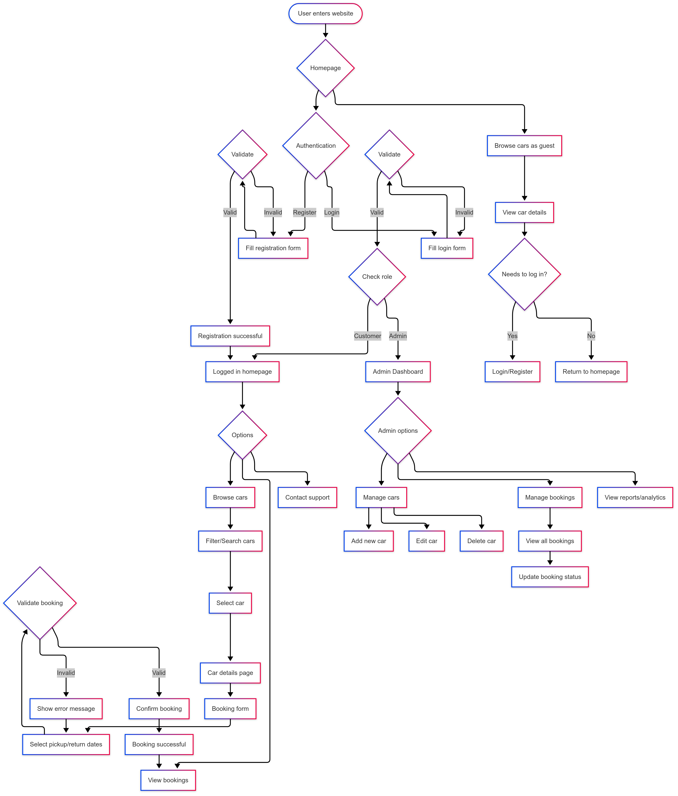
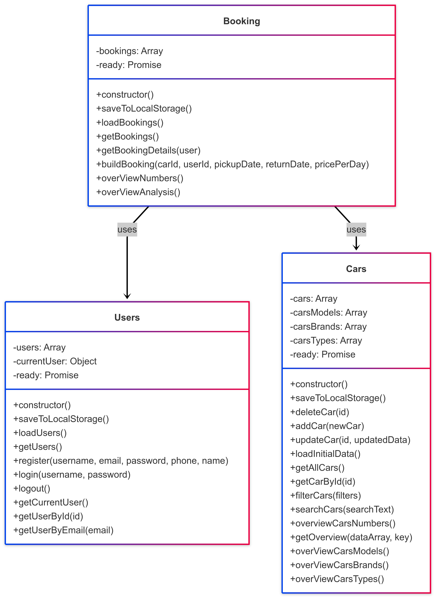

# 🚘 Car Rental System with Admin Dashboard

A responsive, client-side Car Rental System built with **HTML**, **CSS**, **JavaScript**, and **Bootstrap**. It allows customers to browse and book cars, while admins manage listings, bookings, and reports through a dashboard interface.

[🌐 Live Demo](https://car-rental-system-chi-two.vercel.app/)

## ⚙ Technologies Used

- HTML5 & CSS3
- JavaScript (ES6+)
- Bootstrap 5
- LocalStorage (for data persistence)
- Chart.js (Admin analytics)

## 🧭 User Flow Diagram

This diagram illustrates the overall navigation and interaction flow within the system.

---

## 🧱 Class Diagram

This diagram shows the main classes and their relationships.

## ✨ Features

### 👥 User Functionality
- **Registration & Login** with validation
- Browse car listings
- Filter/search by brand, model, type, or price
- View car details
- **Book cars** with date/time validation
- View **booking history**
- Dynamic UI & toast notifications

### 🛠️ Admin Functionality
- Secure admin login
- Add, update, or delete car listings
- View all bookings & manage their status
- Access visual analytics (cars by brand/model/type, booking status)
- Admins can't book cars (restricted access)

### 📱 Responsive Design
Fully responsive layout for mobile, tablet, and desktop using Bootstrap.

## 🔒 Booking Rules & Validations

- Booking unavailable without login
- No same-day or overlapping rentals
- Detects:
  - Already booked cars
  - Technical issues or sold vehicles
- Car availability is updated in real time
- Prevents duplicate bookings
- Real-time validation & alerts

## 📊 Admin Analytics

Admins can view real-time statistics via Chart.js, including:

- Car availability

- Booking status

- Cars per brand/model/type

## 📌 Team Members
- Ahmed Bedeir
- Ahmed Assem
- Abdelrahman Ali
- Rahf Hazem
- Mohamed Shawky